# 🧑‍💻 Portfólio Profissional — Lucas Silva Borges

> [!NOTE]
> Website de portfólio profissional **bilíngue (PT/EN)** com apresentação pessoal, **linha do tempo de projetos**, experiências e **formulário de contato com envio por e-mail**.
> Laboratório 01 da disciplina **DIAW — Desenvolvimento e Integração de Aplicações Web** (Engenharia de Software · PUC Minas).

<table>
  <tr>
    <td width="800px">
      <div align="justify">
        Este projeto é um <b>portfólio profissional</b> pensado para apresentar minha trajetória de forma <i>moderna</i>, <i>acessível</i> e <i>responsiva</i>. O conteúdo (projetos, experiências e textos) fica separado da interface em arquivos de dados, então atualizar o portfólio é só editar um arquivo — sem mexer nos componentes. O site é uma <b>SPA em React + Vite</b>, com navegação por rotas, troca de idioma em tempo real, timeline gerada a partir dos dados e envio de mensagens direto do front-end via <b>EmailJS</b>, hospedado gratuitamente na <b>Vercel</b>.
      </div>
    </td>
    <td>
      <div align="center">
        
      </div>
    </td>
  </tr>
</table>

---

## 🚧 Status do Projeto


| Sprint | Entrega | Pontos | Situação |
| :--- | :--- | :---: | :---: |
| **Lab01S01** | Planejamento, wireframes, protótipo inicial, navegação e layout | 4 | ✅ |
| **Lab01S02** | Sobre Mim PT/EN, timeline dinâmica, Experiências, Contato funcional, validações e responsividade | 4 | 🟡 base pronta |
| **Lab01S03** | Deploy na Vercel, ajustes visuais, imagens/GIFs dos projetos e README final | 7 | ⏳ |

---

## 📚 Índice
- [Links Úteis](#-links-úteis)
- [Sobre o Projeto](#-sobre-o-projeto)
- [Funcionalidades Principais](#-funcionalidades-principais)
- [Protótipos (Wireframes)](#-protótipos-wireframes)
- [Tecnologias Utilizadas](#-tecnologias-utilizadas)
- [Arquitetura](#-arquitetura)
- [Instalação e Execução](#-instalação-e-execução)
- [Deploy](#-deploy)
- [Estrutura de Pastas](#-estrutura-de-pastas)
- [Demonstração](#-demonstração)
- [Documentações utilizadas](#-documentações-utilizadas)
- [Autores](#-autores)
- [Licença](#-licença)

---

## 🔗 Links Úteis
* 🌐 **Demo Online:** _em breve (Sprint 03 — Vercel)_
  > 💻 Link para o site publicado em produção na Vercel.
* 📂 **Código-fonte:** [`/portfolio`](./portfolio)
* 🎨 **Wireframes:** [`/docs/wireframes`](./docs/wireframes)

---

## 📝 Sobre o Projeto

- **Por que existe:** recrutadores e professores precisam ver, em poucos minutos, quem eu sou, o que já construí e como falar comigo. Um portfólio próprio reúne isso num lugar só, com links diretos para o código no GitHub.
- **Qual problema resolve:** os projetos da faculdade ficam espalhados em pastas de repositórios; o portfólio organiza esses trabalhos numa linha do tempo, com descrição, tecnologias, imagem e link para o repositório.
- **Contexto:** acadêmico — Laboratório 01 da disciplina DIAW (2º período de Engenharia de Software, PUC Minas) — mas pensado para continuar sendo usado profissionalmente depois.
- **Onde pode ser usado:** currículo, LinkedIn, candidaturas a estágio e apresentações.

---

## ✨ Funcionalidades Principais

- 🧭 **Menu de navegação** com rotas para Sobre Mim, Projetos, Experiências e Contato (com menu hambúrguer no celular).
- 🌐 **Bilíngue (PT/EN):** troca de idioma em tempo real, lembrando a escolha do visitante.
- 🙋 **Sobre Mim:** formação, área de atuação, interesses, objetivos e tecnologias.
- 🗓️ **Projetos em timeline:** ordenados automaticamente do mais antigo ao mais recente, cada um com nome, descrição, tecnologias, link do GitHub e imagem/GIF.
- 💼 **Experiências:** empresa/instituição, cargo ou atividade, período, tipo (estágio, freela, open source, evento…) e descrição.
- ✉️ **Contato:** ícones clicáveis (e-mail, WhatsApp, LinkedIn, GitHub) e formulário com **validação** de nome, e-mail e mensagem, enviado por **EmailJS**.
- 📱 **Responsivo e acessível:** layout mobile-first, link "pular para o conteúdo", foco visível, `aria-*` nos controles e respeito a `prefers-reduced-motion`.

---

## 🎨 Protótipos (Wireframes)

Wireframes de **média fidelidade** feitos antes da implementação. Os arquivos `.svg` em [`docs/wireframes`](./docs/wireframes) podem ser **arrastados direto para o Figma**, onde viram vetores editáveis.

| Sobre Mim | Projetos (timeline) |
| :---: | :---: |
| 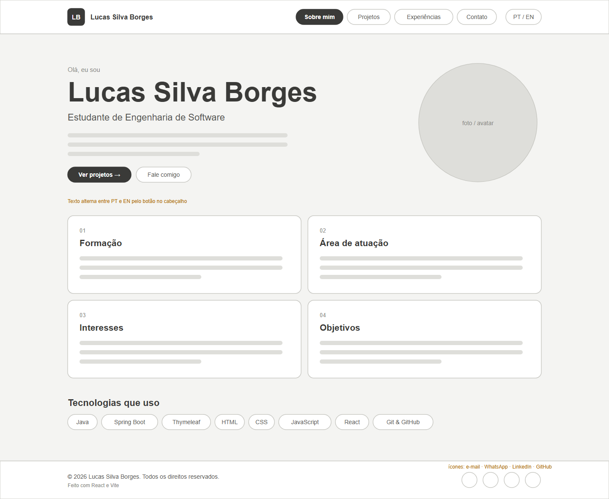 | 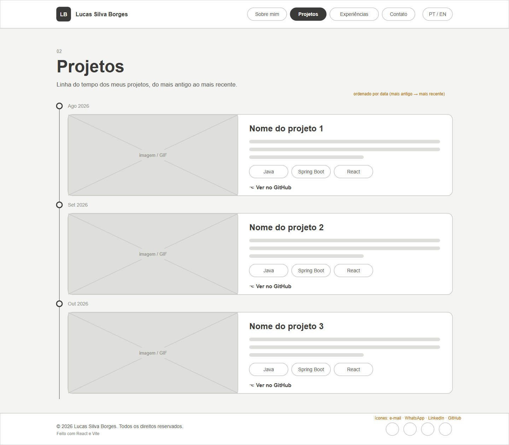 |
| **Experiências** | **Contato** |
| 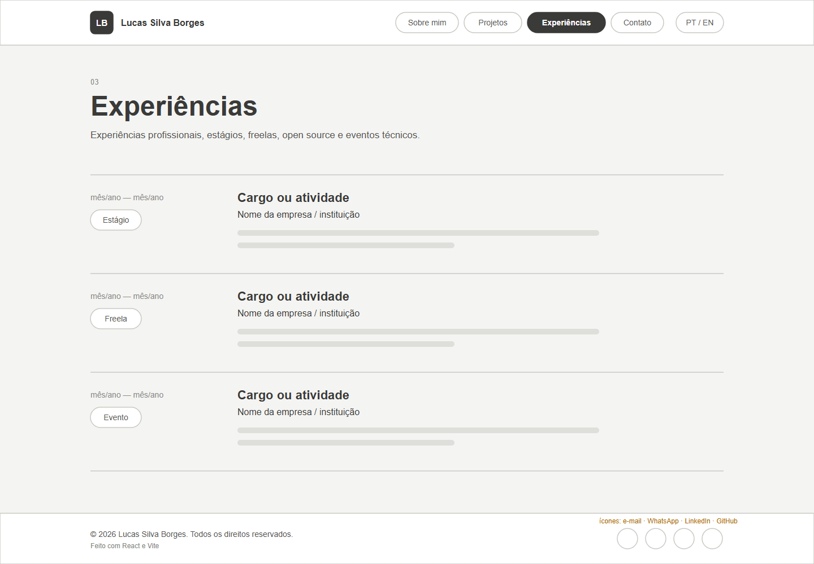 | 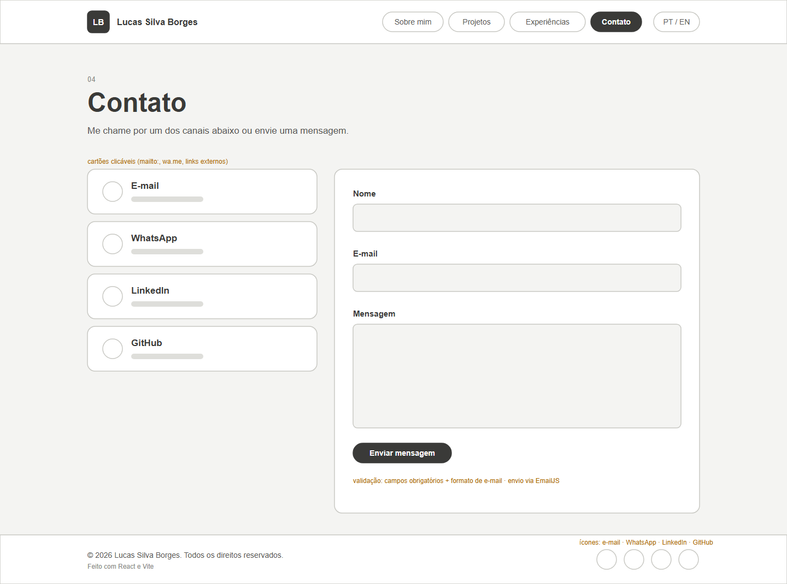 |

| Mobile — Sobre Mim e menu aberto |
| :---: |
| 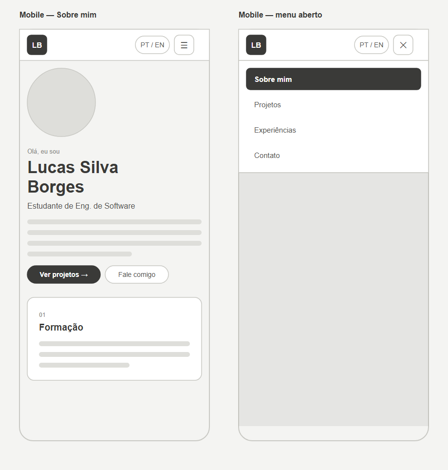 |

### Identidade visual

| Elemento | Escolha |
| :--- | :--- |
| Fundo | Grafite `#101114` com superfícies `#17191e` / `#1d2026` |
| Destaque | Âmbar `#ffb347` → laranja `#ff8a3d` (botões, links, timeline) |
| Títulos | **Space Grotesk** |
| Texto | **Inter** |
| Rótulos, datas e tags | **JetBrains Mono** — referência ao universo de código |

---

## 🛠 Tecnologias Utilizadas

### 💻 Front-end

* **Biblioteca:** React 19.3
* **Linguagem:** JavaScript (ES2022+) com JSX
* **Roteamento:** React Router 7.18
* **Estilização:** CSS puro com variáveis (design tokens) e media queries
* **Ícones:** React Icons 5.7 (Feather + Font Awesome)
* **Gerenciamento de Estado:** Context API (idioma) + `useState`
* **Build Tool:** Vite 8.3
* **Lint:** Oxlint

### 🔌 Integrações

* **E-mail:** EmailJS (`@emailjs/browser` 5.0) — envio direto do front-end, sem servidor próprio

### ⚙️ Infraestrutura

* **Cloud:** Vercel (hospedagem estática gratuita, com deploy automático a cada push)
* **Versionamento:** Git + GitHub

### 📦 Dependências

| Pacote | Versão | Tipo | Para que serve |
| :--- | :---: | :---: | :--- |
| `react` / `react-dom` | 19.3.0 | produção | Construção da interface |
| `react-router-dom` | 7.18.4 | produção | Rotas das páginas e menu ativo |
| `react-icons` | 5.7.0 | produção | Ícones de e-mail, WhatsApp, LinkedIn, GitHub, menu |
| `@emailjs/browser` | 5.0.2 | produção | Envio do formulário de contato por e-mail |
| `vite` | 8.3.4 | dev | Servidor de desenvolvimento e build |
| `@vitejs/plugin-react` | 6.1.2 | dev | Suporte a JSX/React no Vite |
| `oxlint` | 1.87.0 | dev | Análise estática do código |

---

## 🏗 Arquitetura

O site é uma **SPA (Single Page Application) estática**: o Vite gera HTML, CSS e JS na pasta `dist/`, que é servida pela Vercel. Não há back-end próprio — a única integração externa é o EmailJS, chamado direto do navegador.

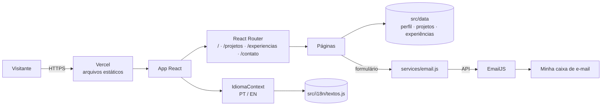

**Decisões principais**

- **Conteúdo separado da interface:** projetos, experiências e dados pessoais ficam em `src/data/`, e os textos fixos em `src/i18n/textos.js`. As páginas só leem e renderizam — adicionar um projeto à timeline é adicionar um objeto no array.
- **Timeline dinâmica:** a página ordena os projetos pelo campo `data` (`AAAA-MM`), então a ordem no arquivo não importa.
- **Internacionalização com Context API:** um `IdiomaProvider` guarda o idioma atual (salvo no `localStorage`) e expõe `t` (textos) e `alternar()`. Para algo deste tamanho não vale adicionar uma biblioteca de i18n.
- **Layout compartilhado:** `Layout` renderiza cabeçalho, `<Outlet />` e rodapé; as rotas ficam aninhadas nele.
- **Camada de serviço:** `services/email.js` isola o EmailJS. Se as variáveis de ambiente não estiverem configuradas, o formulário avisa em vez de falhar silenciosamente.
- **CSS sem framework:** tokens em `:root` (cores, fontes, raios) garantem identidade visual consistente sem dependências extras.
- **Trade-off:** sem back-end, as chaves do EmailJS ficam expostas no bundle (é o modelo previsto pelo EmailJS, que usa chave pública + lista de domínios permitidos). Para evitar abuso, restrinja o domínio da Vercel no painel do EmailJS.

---

## 🔧 Instalação e Execução

### Pré-requisitos

* **Node.js:** v20.19+ ou v22.12+ (testado com v24)
* **Gerenciador de pacotes:** npm

### 🔑 Variáveis de Ambiente

Copie `portfolio/.env.example` para `portfolio/.env.local` e preencha com os dados da sua conta no [EmailJS](https://dashboard.emailjs.com/):

| Variável | Descrição | Exemplo |
| :--- | :--- | :--- |
| `VITE_EMAILJS_SERVICE_ID` | ID do serviço de e-mail conectado no EmailJS | `service_abc123` |
| `VITE_EMAILJS_TEMPLATE_ID` | ID do template de e-mail | `template_xyz789` |
| `VITE_EMAILJS_PUBLIC_KEY` | Chave pública da conta | `AbCdEfGh123` |

O template do EmailJS deve usar as variáveis `{{from_name}}`, `{{from_email}}` e `{{message}}`.

> **Obs:** sem essas variáveis o site funciona normalmente; só o envio do formulário mostra um aviso de "não configurado".

### 📦 Instalação de Dependências

```bash
git clone https://github.com/LucasSilvaBorges02/diaw.git
cd "diaw/TRABALHO/TRABALHO PRÁTICO 1/portfolio"
npm install
```

### ⚡ Como Executar

```bash
npm run dev
```

🎨 *O site estará disponível em **http://localhost:5173**.*

Outros comandos:

| Comando | O que faz |
| :--- | :--- |
| `npm run build` | Gera a versão de produção em `dist/` |
| `npm run preview` | Serve a pasta `dist/` localmente para conferir o build |
| `npm run lint` | Roda o Oxlint |

### ✏️ Como editar o conteúdo

| Quero mudar… | Arquivo |
| :--- | :--- |
| Nome, e-mail, WhatsApp, LinkedIn, foto, tecnologias | `portfolio/src/data/perfil.js` |
| Projetos da timeline | `portfolio/src/data/projetos.js` |
| Experiências | `portfolio/src/data/experiencias.js` |
| Textos de Sobre Mim e da interface (PT e EN) | `portfolio/src/i18n/textos.js` |
| Imagens/GIFs dos projetos | `portfolio/public/projetos/` (e referenciar no campo `imagem`) |

---

## 🚀 Deploy

Deploy na **Vercel** (Sprint 03):

1. Em [vercel.com/new](https://vercel.com/new), importe o repositório `LucasSilvaBorges02/diaw`.
2. Em **Root Directory**, selecione `TRABALHO/TRABALHO PRÁTICO 1/portfolio`.
3. A Vercel detecta o Vite sozinha (build `npm run build`, saída `dist`).
4. Em **Environment Variables**, cadastre as três variáveis `VITE_EMAILJS_*`.
5. Clique em **Deploy**. A cada `git push` na `main` o site é atualizado automaticamente.

O arquivo `portfolio/vercel.json` redireciona todas as rotas para o `index.html`, para que links como `/projetos` funcionem ao recarregar a página.

---

## 📂 Estrutura de Pastas

```
TRABALHO PRÁTICO 1/
├── README.md                     # 📘 Este documento
├── docs/
│   ├── wireframes/               # 🎨 Wireframes (.svg editável no Figma + .png)
│   └── prints/                   # 🖼️ Capturas de tela do protótipo
└── portfolio/                    # 📁 Aplicação React (Vite)
    ├── .env.example              # 🧩 Variáveis do EmailJS (sem valores reais)
    ├── index.html                # 📄 HTML base, fontes e metadados
    ├── vercel.json               # ☁️ Rewrite das rotas para a SPA
    ├── package.json              # 📦 Dependências e scripts
    ├── public/
    │   ├── favicon.svg           # 🏷️ Logo "LB"
    │   └── projetos/             # 🖼️ Imagens/GIFs dos projetos
    └── src/
        ├── main.jsx              # 🚪 Ponto de entrada
        ├── App.jsx               # 🧭 Definição das rotas
        ├── components/           # 🧱 Header, Footer, Layout, SocialLinks, TituloPagina
        ├── pages/                # 📄 Sobre, Projetos, Experiencias, Contato, NaoEncontrada
        ├── data/                 # 🗂️ perfil.js, projetos.js, experiencias.js
        ├── i18n/                 # 🌎 IdiomaContext.jsx e textos.js (PT/EN)
        ├── services/             # 🔌 email.js (integração com EmailJS)
        └── styles/               # 🎨 global.css (tokens, layout e responsividade)
```

---

## 🎥 Demonstração

Protótipo navegável da Sprint 01 rodando localmente.

### 🌐 Desktop

| Sobre Mim | Projetos | Experiências |
| :---: | :---: | :---: |
| 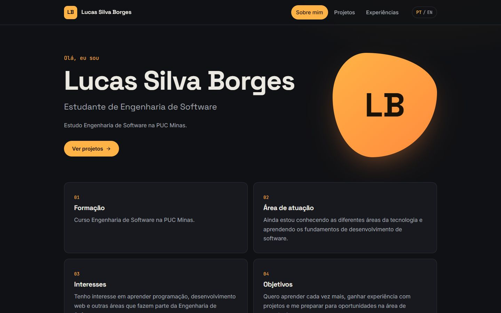 | 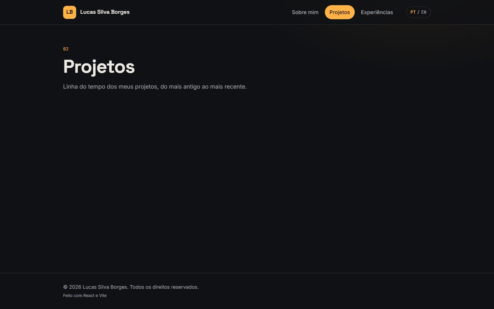 | 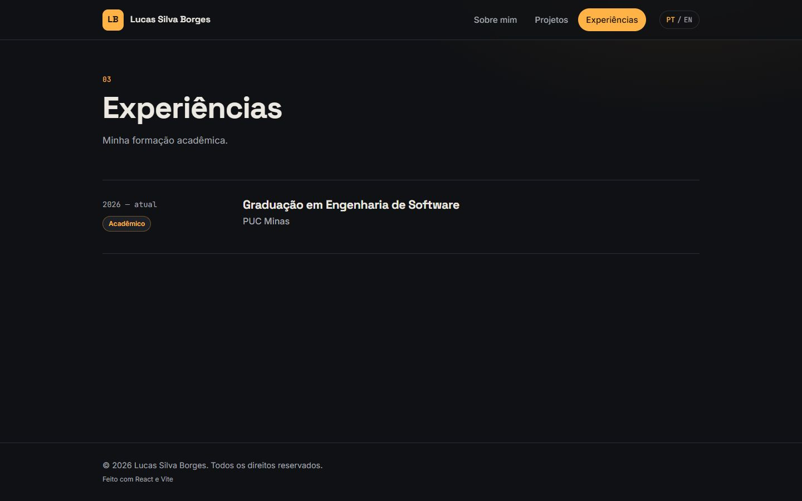 |

### 📱 Mobile

| Sobre Mim | Projetos | Menu |
| :---: | :---: | :---: |
| 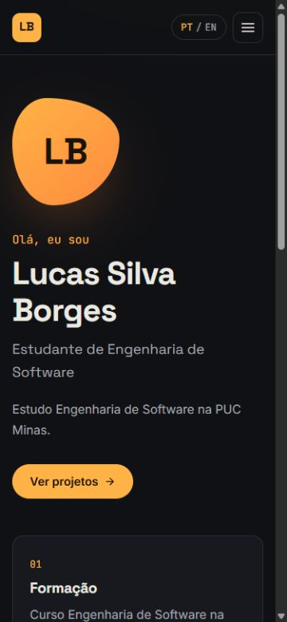 | 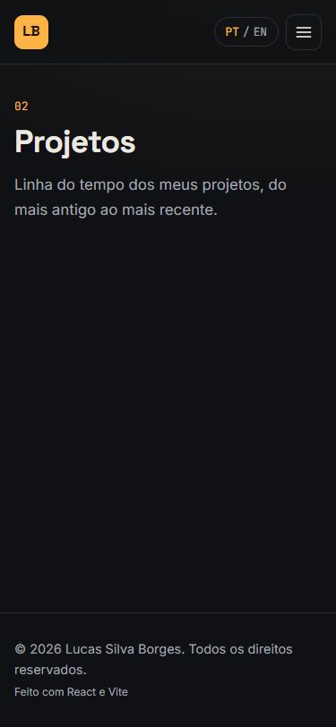 | 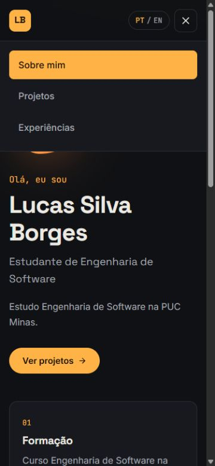 |

---

## 🔗 Documentações utilizadas

* 📖 [Documentação oficial do **React**](https://react.dev/reference/react)
* 📖 [Guia do **Vite**](https://vite.dev/guide/)
* 📖 [**React Router**](https://reactrouter.com/)
* 📖 [**EmailJS** — SDK para navegador](https://www.emailjs.com/docs/sdk/installation/)
* 📖 [**Vercel** — deploy de projetos Vite](https://vercel.com/docs/frameworks/frontend/vite)
* 📖 [**React Icons**](https://react-icons.github.io/react-icons/)

---

## 👥 Autores

| 👤 Nome | :octocat: GitHub |
|---------|-----------------|
| Lucas Silva Borges | [@LucasSilvaBorges02](https://github.com/LucasSilvaBorges02) |

---

## 🙏 Agradecimentos

* [**Engenharia de Software PUC Minas**](https://www.instagram.com/engsoftwarepucminas/) — pelo apoio institucional e estrutura acadêmica.
* [**Prof. Dr. João Paulo Aramuni**](https://github.com/joaopauloaramuni) — pela proposta do laboratório e pelo template de README.

---

## 📄 Licença

Este projeto é distribuído sob a **Licença MIT**.
